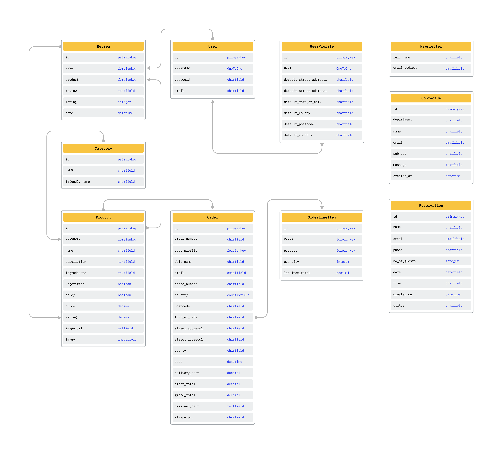
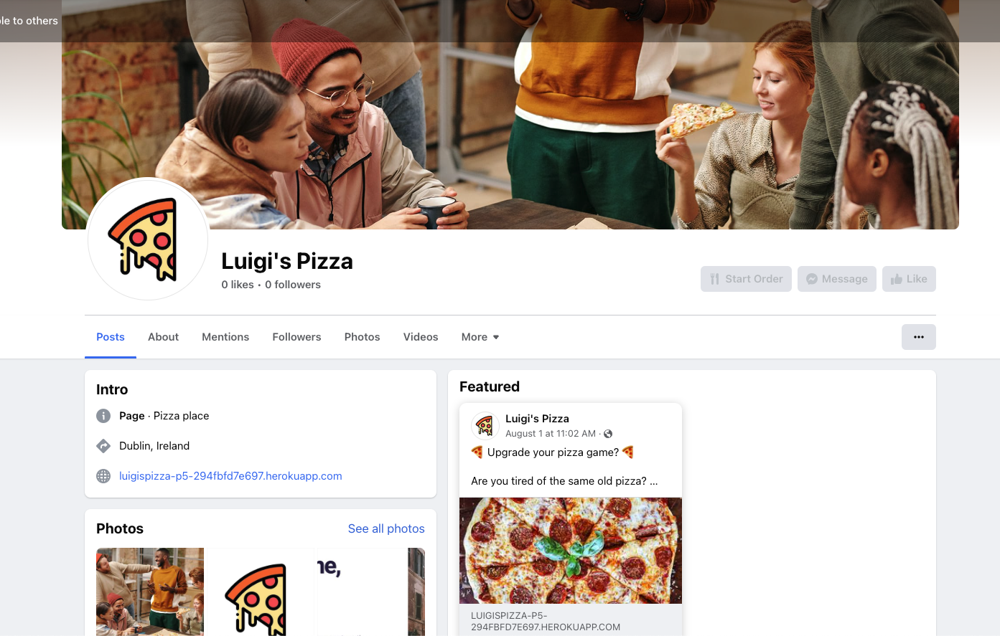

# Luigis Pizza

## Project Overview

Luigi's Pizza is an eCommerce site, built using Django, Python, Javascript and Bootstrap 4. This is my final Project Portofolio for Full-Stack Diploma @CodeInstitute

'Luigi's Pizza' website is designed and build as a fictitious online store of a pizzeria, with the purpose of creating an online order system for the store to extend its customer reach. The design is simple and intuitive to allow the users to order pizza for delivery.

[Mockup Generator](https://websitemockupgenerator.com/) was used to show the website image on a range of devices.

Please visit the live site via [this link](https://luigispizza-p5-294fbfd7e697.herokuapp.com/).

 

# CONTENTS

1. [User Experience(UX)](#ux)

2. [Agile Methodologies](#agile)

3. [Design](#design)

4. [Features](#features)

5. [Technologies](#technologies)

6. [Testing](#testing)

7. [Deployment](#deployment)

8. [Credits](#credits)

 

## User Experience (UX) Design

### User Stories

The purpose of the project was to create a user-centric website, taking in consideration the main user stories:

    * Store Owner Goals:

        * Create a visually appealing design to attract users
        * Implement a user-friendly front-end for easy navigation
        * Enable user account management and product management
        * Provide means for managing and moderating user-generated content
        * Develop a responsive design that works seamlessly on various devices

    * User Goals:

        * Allow users to create accounts and have control over their information
        * Provide a straightforward and efficient browsing experience for content discovery
        * Delivery a responsive and user-friendly design that functions well on all devices
        * The ability to add/edit/remove/update items in the shopping cart

The goal of the e-commerce is to encourage users to browse and order food for delivery. The design is intuitive and clean allowing the user the ability to choose what they would like to order using an approachable process flow.

All interaction with the site is designed to produce a positive emotional response within the user. This is down to the flow of information layout, use of colour, clear and unambiguous navigation structures and user action feedback. There are no aggressive automatic pop-ups.  A user can control all actions and is shown a progress indicator and feedback on financial transactions.

### Scope

With the structure in place, it was then time to move onto the scope plane. This was all about developing website requirements based on the goals set out in the strategy plane. These requirements are broken down into two categories: content and functionality

Content:
- A list of products that can be purchased
- Privacy Policy and Terms & Conditions implemented
- Reviews of the products from other users
- Information about the business and owner
- Landing page with information about the products (ingredient sourcing, business scope, promotions, etc)
- Links to the store's social media accounts

Functionality:
- Browse products on the website
- Create an account
- Add products to a cart
- Edit/delete products from the cart
- Leave reviews on products
- Pay for orders using a secure payment solution (Stripe)
- Make a reservation for a table
- Contact the store for enquires
- Sign up for a newsletter

### Structure

Navigation:
- Implement responsive navigation accross all pages.
- Include cart functionality to show total amount and number of products in cart.
- Implement a search functionality to allow customers to find products based on product name, category or keywords.

Registration and User Profiles:
- User registration and login functionality for customers to create and manage their accounts.
- User authentication and access control to ensure secure and personalized experiences.
- Allow user to edit their details. (user profile page)
- Allow users to view and track their order history. (user profile page)

Products and Sorting:
- Display a list of all products.
- Filter products based on their respective category. (isotope filtering)
- Provide detailed product information, including ingredients, images and ratings.

Shopping Cart, Checkout and Payment Proccess:
- Customers can add products to cart and edit product quantities or remove the product from the cart.
- Implement a secure checkout process, with address and payment information collection.
- Integrate a payment gateway to facilitate secure online transactions. (Stripe)

Admin Panel :
- Implement an admin panel for site administrators to manage products, orders, reservations, newsletter signups and user accounts.

Responsive Design :
- Develop a responsive website that provides great user experience across different devices and screen sizes.
- Ensure great navigation and readability on desktops, tablets and mobile devices.

Contact Us :
- Implement a contact form or functionality for users to reach out to the business.

SEO, Marketing and Legal:
- Implement Privacy Policy and Terms & Conditions for the website.
- Create robots.txt, sitemap and add meta description and keywords for the website.
- Create a facebook page for the business.

### Skeleton

The initial wireframes I started from are bellow. Adjustments were made during development to create a better UX experience for the users.

Wireframe Home Page

Wireframe Product List

Wireframe Product Details

 

[Back To Top](#Luigis-Pizza)

## Agile Methodology

As I was developing the project on multiple devices I have decided to create a Google Spreadsheet for the Agile Methodology. Working by myslef I find it easier to use a spreadsheet insteam of an Agile SaaS product that is more efficient for teams.

While creating the User Stories I implemented the MoSCoW Prioritization Method. This way I focused on more important task first. Every User Story is part of a Milestone and have an accentance criteria.

For the Jazzmin implementation, it was working fine before deployment. After deployment, admin wasn't working so I had to give up to this functionality and reeverse to original django admin.

Agile Methodology

 

[Back To Top](#Luigis-Pizza)

## Design

For the project I have used a website template that I had bought previously and I hold a license for commercial and personal use. In order to create the project I did make adjustments to the template in order to cover my User Stories and project functionality.

### Colors

As for the colors I opted for simple and clean color scheme. Yellow is a versatile color that can be used effectively in website design. It is often associated with happiness, optimism, and creativity. It can also be used to grab attention and create a sense of urgency.

Color Scheme

### Typography

I chose Roboto font from Google Fonts for my project. It is a sans-serif font that is easy to read on a variety of devices and screen sizes. It is also a versatile font that can be used for a variety of purposes, such as headlines, body text, and buttons.

### Favicon

A favicon appears in the browser tab with the website name as a visual reminder to enable a user to easily recognise and identify a company's website in a busy browser with many open tabs.  

The favicon image is from [freepik.com](www.freepik.com). I have used [favicon.io](https://favicon.io/) to generate the favicon files and the link tags to insert in the head of base template.

### Database Schema 

The Database schema was created using [FigJam](www.figma.com)

Database schema

[Back To Top](#Luigis-Pizza)

## Features

#### Homepage

#### About

About us

- And on the same page with about us there is a fost for Reservation in case the user wants to reserve a table to dine-in.

Reservation

#### Registration/Authentication

For the resgistration and authentication pages, the website colors were used to create a complete look.

Sign In

Register

#### Navigation 

The Navigation bar of the website is designed to help the user to move smoothly around the site.

- Logo to create a string brand presence.
- Search bar.
- My Account, which contains Registration and Login features to an unauthenticated user, or the Logout and Profile for authenticated users. For superuser/store admin instead of Profile we have Add Product features.
- Shopping Cart and Checkout function.
- Navigation links to all pages of the website.

Navigation

Navigation Mobile

#### Shopping Cart 

When a product is successfully added to cart, a Mini Cart is displayed together with the success message, showing the user a shor description of their shopping cart.

Mini Cart

Within the shopping cart page, a user has additional functionality and can increase or decrease the quantity of a product they have selected, or remove it entirely. Also the customer can see the total amount of their purchase updated after every change they make.

Cart

#### Checkout

A user can finalise their purchase of the products on this page. The user is required to add shipping details for the order delivery and securely add the card details. The processing of the user's card is managed using Stripe secure payments system.

Checkout

Checkout Success

#### Products

The Product List page contains all the products available to the user. They can be filtered using the fitlers on the top of the page, based on the categories they are part of.

Product List

#### Product Detail

Product name, description, rating, price and a quantity picker are some of the features of this page. A product can be added to the shopping cart, and the quantity of the product can be adjusted.

On the product detail page a user can leave a review to the product. The option for review is only visible if the user is authenticated. After the review, the product rating will be adjusted automaticaly.

Product Details

#### CRUD

All of the major functions of the product management for Luigi's Pizza can be controlled by the authenticated Store Owner through the front-end on the Products page or the Product detail page.  New products can be added, and existing product detail can be edited, or deleted from the store entirely.

Product Edit/Delete

Add Product

- The profile page contains a form where the user can update their shipping information and a table with order history.

Profile Page

#### Footer

The footer contains a link to facebook page, Policy Privacy and Terms & Conditions.

Footer

#### 404 Error Page

404 Page

### Future Implementations

Future features to develop will be:

- enable the Store Owner to reply to customer reviews.
- authenticated users to edit reservations details.
- enable order status (in progress, preparing, out for delivery, delivered)

[Back To Top](#Luigis-Pizza)

## Technologies Used**
 

### Languages Used:
 

 

### Frameworks, Libraries & Programs Used:
 

      

    

 

[Back To Top](#Luigis-Pizza)

## Marketing

### Marketing Strategies

#### PPC ads: 

- Pay-per-click (PPC) advertising to drive traffic to the website. PPC advertising will be used to drive traffic to the website. PPC advertising will be used to target specific keywords that are relevant to the website. This will help to ensure that the website is seen by people who are interested in buying pizzas in the area that we serve.

##### Newsletters:

- Email marketing to stay in touch with customers and promote new products and offers. Email marketing will be used to stay in touch with customers and promote new products and offers. We will collect customer email addresses when they visit the website. We will then use these email addresses to send out regular newsletters and promotions.

##### Social Media Marketing - Facebook business page:

- As Facebook has the largest number of users and the widest demographic, I created a Facebook Business Page. Through the presence on Facebook, I can start ads campaign targeting only the audience from a specific area, city, age. Makes it the perfect social media paltform for marketing.

404 Page

 

#### SEO:

- After adding meta tags to my head element to optimize my website's visibility and improve search engine performance, I also added keywords to attract both search engines and users. For the keywords I decided to use [XML-Sitmaps](https://online.seranking.com) to check the competition and make sure I pick the best keywords.
I used [XML-Sitmaps](www.xml-sitemaps.com) to generate an xml file.  Google uses this xml file to help it understand the website's structure and how the pages link to each other.

#### Robots.txt and Sitemap.xml:

- robots.txt is a simple text file that tells search engines where they are not allowed to go on the application.  In Bookworms, the robots.txt file is in the root directory and includes the admin, profiles and checkout directories as urls that the spiders are not permitted to access.

- sitemap.xml is a file that lists a website's import page urls, making sure that search engines can crawl, or navigate through them.  It helps a search engine to understand our website's structure and crawl every essential page on the website.  sitemap.xml was generated on [xml-sitemaps.com](https://www.xml-sitemaps.com/details-mym-bookworms-et-al-b7ea61e35a6e.herokuapp.com-49873d773.html) and is located in the root directory.

 

## Privacy Policy T&Cs:

- A Privacy Policy is a document neccesary for any online presence that collects data from users. It's purpose is to be transparent and inform users about how their data is being collected and processed. 

- Terms & conditions (T&Cs) are a set of rules that govern the use of the website. They cover things like privacy, liability, and termination. T&Cs are important because they protect both the user and the business.

[Back To Top](#Luigis-Pizza)

## Testing
 

Testing is documented in [testing.md](TESTING.md) file.

 

## Setup and Deployment

### Creating the Workspace Project repository ###

1. This project has been created by using the full Code Institute provided template which you can find here : <a href="https://github.com/Code-Institute-Org/gitpod-full-template">Gitpod Full Template - Code Institute</a>
2. Click : Create New repository - using that template.
3. Name : Name the repository/project 
4. Launch : Launch the creation of the repository as it can take a few minutes to complete.

## Initial Workspace Installations ##

* Here are the steps to install the necessary frameworks/packages 

1. Installation of Django : 
    
        pip3 install django==3.2

2. Installation of Gunicorn : 
    
         pip3 install gunicorn

3. Installation of Libraries :

         pip3 install dj_database_url
        
         pip3 install psycopg2-binary

4. Create the requirements file with the installed libraries/packages :

* (Note you have to run this command again should you install any more dependancies)!
    
        pip3 freeze --local > requirements.txt

5. Now you create your project : 

* You do this by running the command :
    
        django-admin startproject (PROJECT_NAME) . 
        
    * (Make sure to include the full stop at the end)

6. Next you create your app :

* You do this by running the command :
    
         python3 manage.py startapp (APP_NAME)
    
    * As soon as you created your app make sure to add the app into your settings.py under the section of INSTALLED_APPS. This is important.

7. Here you run your migrations again :

* Make your migartions by :
    
         python3 manage.py makemigrations

    * also a good idea to run : python3 manage.py makemigrations --dry-run to have a pre-flight check before you make any changes.

* Migrate your changes to the database : 

        python3 manage.py migrate

* You can test your website then locally by running : python3 manage.py runserver
    * This is good to make sure everything is set up and working correctly. If everything is correct you will see the Django Default Page.

8. Create your env.py file in the root directory.

## Database Setup ##

Next you have to create a database to store all your data in. This project is built on the ElephantSQL database which you can find on this link : <a href="https://www.elephantsql.com/">ElephantSQL</a>
The setup is very simple by following these steps :

1. Head to the website and login / make an account (I have signed in using GitHub).

2. Create a new instance 

3. Choose the plan , here we select the Tiny Turtle (Free Plan)

4. Select the Region that would be the closest to where you are located.

5. Now once the instance is created click on your database which will uncover your dashboard for your database.

6. Now here , you will have a DATABASE_URL to your ElephantSQL database that you will need to copy and set up in your project.

7. Copy that URL and add it into your env.py file that you have in your root directory. It should look like this : 
    
        import os

        os.environ["DATABASE_URL"] = ("postgres://your-database-url")

## Amazon Web Services ( AWS ) ##

Here we have to set up our media/static storage for our project. For this one I have used AWS. You will need to head to the <a href="https://aws.amazon.com/">AWS</a> website and create an account.

Next are the steps to get you set up in the AWS.

### S3 Buckets ###

1. In the search bar look for S3
2. Create your new bucket , preferably matching your heroku project name and choose your region.
3. Uncheck the "Block all public access" option.
4. Enable ACLs under "Object Ownership" and select "Bucket owner preferred".
5. In the "Properties" tab, activate static website hosting and enter "index.html" and "error.html" in the respective fields.
6. Paste the following CORS configuration under the "Permissions" tab :

        [
            {
                "AllowedHeaders": ["Authorization"],
                "AllowedMethods": ["GET"],
                "AllowedOrigins": ["*"],
                "ExposeHeaders": []
            }
        ]
7. Take a note of your ARN string.

### Adjust Bucket Policy ###

1. Go to "Bucket Policy" tab and select "Policy Generator".
2. Set the "Policy Type" as "S3 Bucket Policy", "Effect" as "Allow", "Principal" as "*", "Actions" as "GetObject" and paste your ARN into the "Amazon Resource Name(ARN)" field.
3. Generate the policy, copy it and paste into the Bucket Policy Editor.

        {
            "Id": "Policy1234567890",
            "Version": "2012-10-17",
            "Statement": [
                {
                    "Sid": "Stmt1234567890",
                    "Action": ["s3:GetObject"],
                    "Effect": "Allow",
                    "Resource": "arn:aws:s3:::your-bucket-name/*",
                    "Principal": "*"
                }
            ]
        }
4. Append "/*" to the end of the "Resource" key before saving.
5. In the ACL( Access Control List ) section, enable "List", for Everyone.

### Create user and User Group in IAM :

1. Open IAM (Identity and Access Management) service.
2. Create a new user group, you can name it "group-your-app-name".
3. Select the group you created, navigate to the "Permissions" tab, click "Add Permissions", then "Attach Policies"
4. From the JSON tab, select the "Import Managed Policy" link. Search for S3, select the "AmazonS3FullAccess" policy, then "Import". Paste your ARN from the S3 Bucket into "Resources" key:

        {
            "Version": "2012-10-17",
            "Statement": [
                {
                "Effect": "Allow",
                "Action": "s3:*",
                "Resource": [
                    "arn:aws:s3:::your-bucket-name",
                    "arn:aws:s3:::your-bucket-name/*"
                ]
                }
            ]
        }

5. Review the policy and create it.
6. Attach this policy to your group.
7. Add a new user to the group. Select "Programmatic Access" as the AWS Access Type. Download the .csv file with the user's Access key ID and Secret Access Key.

### Create Media Folder ###

1. In the S3 create a new folder called media which will hold your image files.
2. Upload all the required files for your project into this folder.
3. Make sure the "Manage Public Permissions" is set to "Grant Public Read Access to this object(s)"

### AWS to DJANGO ### 

Here we set the AWS we have set up , with the Django workspace that we have. 

1. First we Install the packages :

        pip3 install boto3
        pip3 install django-storages

2. Next add the 'storages' into the INSTALLED_APPS in settings.py in your project folder.
3. Add your AWS secret variables into the env.py file.

### Project Settings Adjustments ### 

Here I will list all the settings that were added / adjusted in the settings.py of the project folder. 

1. Initial settings / imports at the top of the file.

        import os
        from pathlib import Path
        import dj_database_url

        if os.path.isfile("env.py"):
            import env

2. Secret Key settings : (Note always keep these secret with caution)!

        SECRET_KEY = os.environ.get("SECRET_KEY")

        DEBUG = "DEVELOPMENT" in os.environ 

3. Database settings : This will be the secret url that you have set in the Env.py file.

        DATABASES = {
            'default': dj_database_url.parse(os.environ.get('DATABASE_URL'))
        }

4. Media and Static files : 

        STATIC_URL = '/static/'
        STATICFILES_DIRS = (os.path.join(BASE_DIR, 'static'),)

        MEDIA_URL = '/media/'
        MEDIA_ROOT = os.path.join(BASE_DIR, 'media')

5. Add the following imports into your URLS.py in your project folder.

        from django.conf import settings
        from django.conf.urls.static import static

        followed by the following command at the end of the urlpatterns: 

        urlpatterns = [
            path(your paths),
        ]+ static(settings.MEDIA_URL, document_root=settings.MEDIA_ROOT) 

6. Template DIRS setting : 

        TEMPLATES = [
            {
                'DIRS': [
                    os.path.join(BASE_DIR, 'templates'),  *// ADD THIS // *

7. AWS Setup :

        if 'USE_AWS' in os.environ:

            # Cache control
            AWS_S3_OBJECT_PARAMETERS = {
                'Expires': 'Thu, 31 Dec 2099 20:00:00 GMT',
                'CacheControl': 'max-age=94608000',
            }

            # Bucket Config
            AWS_STORAGE_BUCKET_NAME = 'your-storage-bucket-s3-name' // Your S3 name
            AWS_S3_REGION_NAME = 'your-region-1' // Your Region
            AWS_ACCESS_KEY_ID = os.environ.get('AWS_ACCESS_KEY_ID')
            AWS_SECRET_ACCESS_KEY = os.environ.get('AWS_SECRET_ACCESS_KEY')
            AWS_S3_CUSTOM_DOMAIN = f'{AWS_STORAGE_BUCKET_NAME}.s3.amazonaws.com'

            # Static and media files
            STATICFILES_STORAGE = 'custom_storages.StaticStorage'
            STATICFILES_LOCATION = 'static'
            DEFAULT_FILE_STORAGE = 'custom_storages.MediaStorage'
            MEDIAFILES_LOCATION = 'media'

            # Override static and media URLs in production
            STATIC_URL = f'https://{AWS_S3_CUSTOM_DOMAIN}/{STATICFILES_LOCATION}/'
            MEDIA_URL = f'https://{AWS_S3_CUSTOM_DOMAIN}/{MEDIAFILES_LOCATION}/'

8. Create custom_storages.py file in root directory :

        from django.conf import settings
        from storages.backends.s3boto3 import S3Boto3Storage

        class StaticStorage(S3Boto3Storage):
            location = settings.STATICFILES_LOCATION

        class MediaStorage(S3Boto3Storage):
            location = settings.MEDIAFILES_LOCATION

9. Create Procfile in the root directory :

        Once you created the procfile add this command inside : 
        web: gunicorn your_app_name.wsgi:application

        * This file is essential for Heroku Deployment.*

10. Change your allowed hosts at the top to the following : 

        ALLOWED_HOSTS = [
        "project_name.herokuapp.com", 
        "localhost", "local_gitpod_workspace_url"]

        * To run the app on the development side, once your run
        python3 manage.py runserver
        you will need to copy your workspace url and add it into your ALLOWED_HOSTS.

        this usually looks like: https://8000.projectname.... to whatever port it is
        assigned.
        

* At this stage you are ready to make your commit and push changes into your GitHub repository.
With the following commands : 

       1. git add .
       2. git commit -m "Commit Message"
       3. git push

* [Back To Top](#Luigis-Pizza)

## HEROKU ## 

Here we make our final steps by deploying our project on <a href="https://heroku.com/">Heroku</a>

1. Go to the <a href="https://heroku.com/">Heroku</a> website.
2. Create a New App, your app name must be unique.
3. In the settings tab of your Project click "Config Vars"
4. Now here you set all your configurables :

        DATABASE_URL : Your ElephantSQL database url
        SECRET_KEY : Your Django secret key
        AWS_ACCESS_KEY_ID : Your AWS Access Key ID
        AWS_SECRET_ACCESS_KEY : Your AWS Secret Access Key
        USE_AWS : True

        *I reccommend using a Django Secret Key generator to generate a secret
        key for your project. It's good practice to keep all of them different
        accross all your projects and most of all more secure.*

5. Next Link your GitHub repository with your heroku app by going into the Deploy tab, Clicking on the GitHub Icon and searching for your repository name.

6. You can also enable automatic deploys here, so whenever you push changes to your github repository your heroku app will make a new build with the updated changes.

## GitHub Extras ##

Here I will explain how to fork or clone the repository.

### How to Fork ### 

When you fork a repository, you create a seperate copy of the original repository, including all of its code, branches , commits, and other related information.

The steps are as follows :

1. Log into GitHub and locate the desired repository.
2. On the top the repository just under the settings tab there will be a grey Fork button.
3. Once you have clicked the fork button you should now have a copy of your original repository.

### How to Clone ###

When you clone a repository, you create a complete copy of the repository's code, history, branches and other associated files.
Cloning a repository allows you to work with the code locally, make changes and synchronize those changes with the remote repository on GitHub.

The steps are as follows :

1. Navigate to the repository : <a href="https://github.com/adrian-cucuet/luigis-P5">Luigi's Pizza</a>
2. Click on the arrow on the green code button at the top of the list of files
3. Select the 'Local' tab select the 'HTTPS' tab and click the icon to copy the prepopulated link
4. Navigate to your code editor of choice and within the terminal change the directory to the location you want to clone the repository to.
5. Type 'git clone' and paste the HTTPS link you copied from GitHub
6. Press enter, the Forked repository will now clone to your preferred development method on your local machine.

[Back To Top](#Luigis-Pizza)

## Credits

- [Code Institute](https://codeintitute.net/) I have used the starter template for the project and the walkthrough project during development.

- [Starbelly](https://themeforest.net/item/starbelly-restaurant-wordpress-theme/39126188) the template used for the project. I own the license for the template to use for commercial and personal use.

- [Stack Overflow](https://stackoverflow.com/) used for bugs and solutions when I was stuck.

- [FreePik](https://freepik.com/) used for logo and icons.

- [StorySet](https://storyset.com/) used for illustrations on 404, reservation success, contact success page and checkout success page.

- [Isotope](https://isotope.metafizzy.co/) used for filtering the products on Product List page.

### Acknowledgments

- CI slack community for sharing fixes to known bugs.

- CI Student Care for amazing support when I needed the most.

[Back To Top](#Luigis-Pizza)